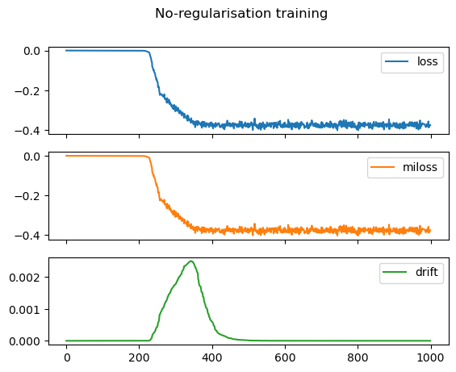
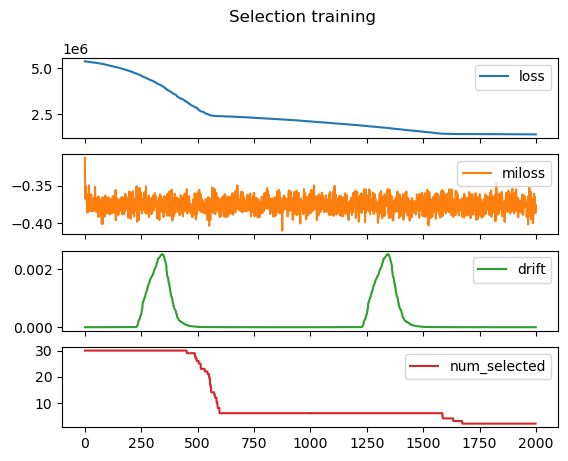

## Experiment 1.A - Categorical variables only

Let
$d$
be a positive integer,
and 
let 
$m > 2$
be  a positive integer larger than $2$.
For
$i = 1, \dots, d$
let
$X_i$
be a random  positive integer
smaller that or equal to $m$.
The random variables
$X_1, \dots, X_d$
are assumed independent and identically distributed.
Fix 
two integers
$1 < k_0 < k_1 < d$
and 
define
$$
	Y = 1(	X_{k_0} = X_{k_1}   )
$$

We consider the task of predicting $Y$ from the vector 
$(X_1, \dots, X_d)$,
and 
we want to select 
from this vector 
the features that are relevant for the prediction.


We adopt the following architecture for Minera:

```
# Design architecture
dimension_of_residual_block = 512
num_res_layers = 4
scaler = 2
emb_dim = 4
```

We run one iteration of training with no-regularisation, 
i.e. with `reg_coef = 0.0`. 
This iteration consists in 4000 epochs.
We initialise the selection weights to `0.20` and we require gradient on these weights too (i.e we set `disable_projection = False`).
We use a learning rate of `5e-6`.

After this first no-regularisation is completed, we load the model and we train it with `reg_coef = 1e6` for 8000 epochs split in two segments of 4000 epochs each. Selection weights are inherited from the no-regularisation training.  
Training ends with the validation loss flattening. when this happens, only two selection weights are non-zero: those that correspond to relevant features in the prediction tasks.


Plots of loss function, mutual information loss, and norm drift of selection weights during training are reported below.





